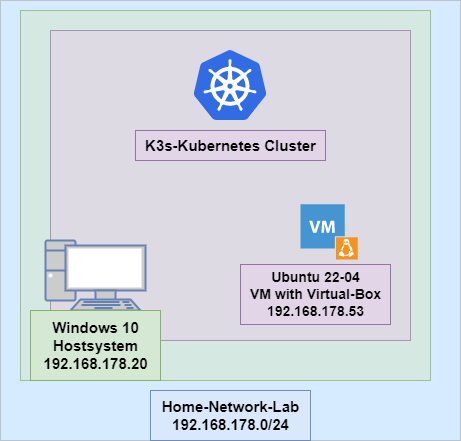
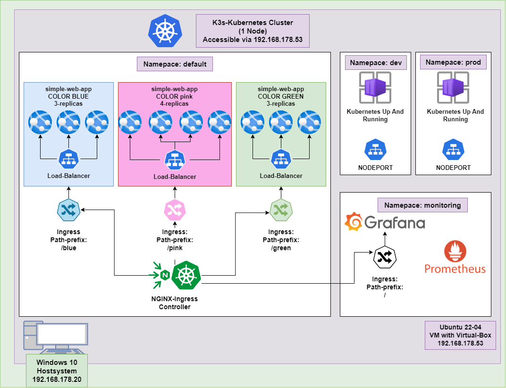
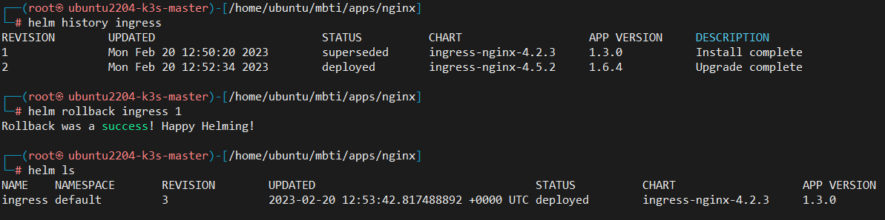
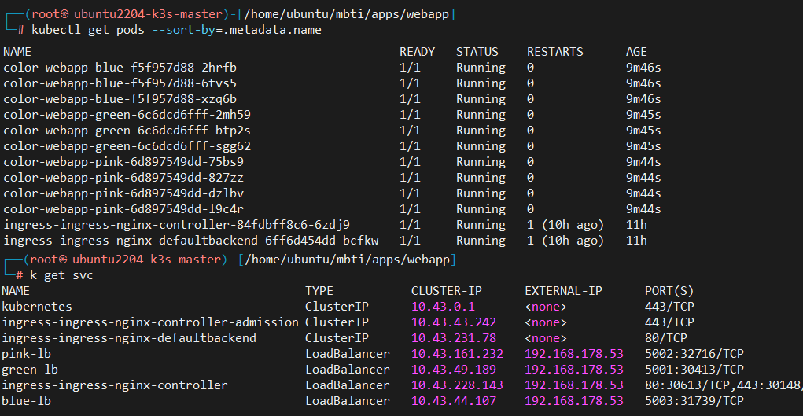
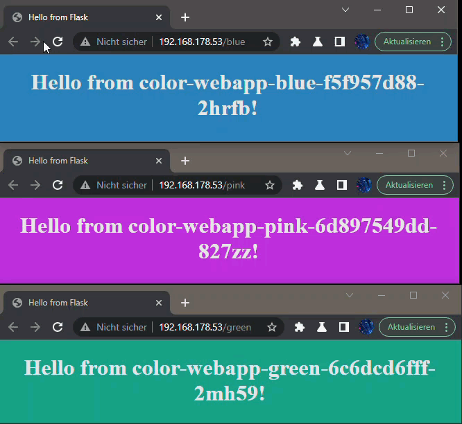
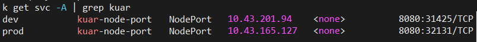
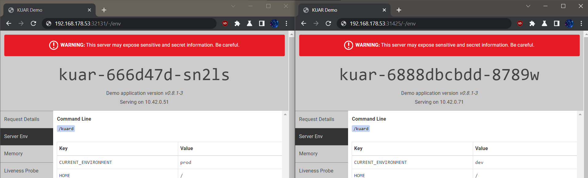
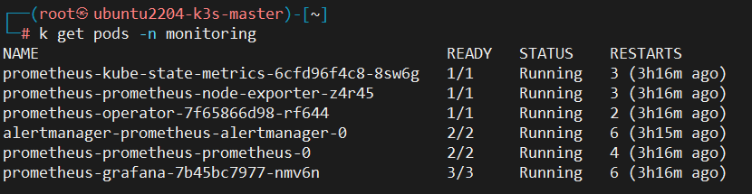
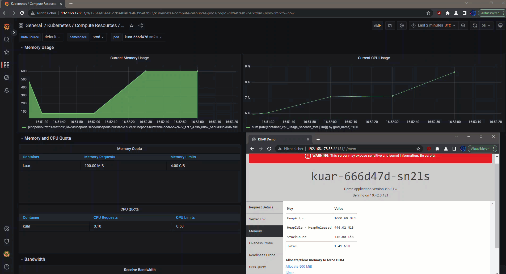

# Documentation for MBTI-DevOps Coding Challenge

This document represents the documentation of the MBTI-DevOps coding challenge.
The documentation is structured as follows


- [Description of the infrastructure](#Description-infra)
	- [Network Configuration](#Network-Configuration)
- [Description of the K3s Kubernetes cluster](#Description-k3s)
 	- [Installation of K3s Kuberntes Cluster](#k3s-install)
 	- [Overview of installed applications and services](#overview)
		- [nginx ingress controller](#nginx)
		- [simple webapp](#webapp)
		- [Kubernetes up and running (KUAR)](#kuar)
	- [Monitoring, Prometheus and Grafana](#monitoring)
- [Possible GitOps solution](#gitops)
<a name="Description-infra"></a>

## Description of the infrastructure 

For the Kuberntes cluster installation approach, it was decided to 
install an Ubuntu 22-04 virtual machine with Virtual Box on the Windows 10 host system.
K3s, a lightweight Kubernetes cluster configuration, was then installed on this VM.



<a name="Network-Configuration"></a>

### Network Configuration
From the network point of view, the Windows host system, the VM and the Kubernetes cluster all run on the same home network, managed by a Fritzbox.
The VM was configured with the network adapter "network bridge". This ensures that the VM receives its own IP from the Fritzbox dhcp server and can therefore be used as an independent server within the network.

This somewhat unusual configuration, allows, however, that at the same time the VM and Kubernetes have an Internet connection and that the standard load balancer driver of k3s (Klipper-LB) works properly. This Klipper-LB enables load balancers created by Kubernetes to be made reachable via the IP address of the VM. 
(The Klipper-LB sets the external IP address of the load balancer from the first network interface, which has a gateway. More info on Klipper-LB [here](https://github.com/k3s-io/klipper-lb)). <br><br>


<a name="Description-k3s"></a>

## Description of the K3s Kubernetes cluster
In this section, we will briefly discuss the installation of k3s, followed by the selected applications and their deployment methods. 

<a name="k3s-install"></a>

### Installation of K3s Kuberntes Cluster
The installation of a Kuberntes cluster with k3s can be done with a single command:
```
curl -sfL https://get.k3s.io |sh -s - \
--docker  \
--disable-cloud-controller \
--disable traefik 
```
Both the cloud provider and the reverse proxy traefik have not been used and are disabled with the arguments <br>
`--disable-cloud-controller` <br>
`--disable traefik `

<a name="overview"></a>

### Overview of installed applications and services
The installed apps and their installation method can be found in the folder [apps/](apps/) 


<a name="nginx"></a>

### Ingress Controller NGINX
As ingress controller nginx was selected, which is installed via helm.
The following steps are required to install and configure nginx.

#### Create folder for nginx:
(see, [apps/nginx](apps/nginx))

#### Add ingress-nginx repo  
```
helm repo add ingress-nginx https://kubernetes.github.io/ingress-nginx 
helm repo update
```
#### Create Chart.yaml and values.yaml
The nginx application to be installed via helm charts is provided via a [apps/nginx/Chart.yaml](apps/nginx/Chart.yaml) and a [apps/nginx/values.yaml](apps/nginx/values.yaml) 

#### Install nginx ingress controller
Change the path to the folder [apps/nginx](apps/nginx) and execute the following commands
```
# download the ingress-nginx chart specified in charts.yaml
helm dep update . 

# Check and validate template for errors
helm template ingress charts/*.tgz -f values.yaml |  kubeval --strict --ignore-missing-schemas

# install nginx ingress controller
helm install ingress charts/*.tgz -f values.yaml
```	
#### Perform upgrades and rollbacks
To upgrade or rollback an application managed with helm, the corresponding helm chart (Chart.yaml) must be adapted and the dependency must be updated/downloaded.
Change the path to the folder [apps/nginx](apps/nginx) and execute the following commands

```
# Change Chart.yaml --> Download Dependency
helm dep update . 

# Upgrade Application
helm upgrade ingress charts/*.tgz -f values.yaml
```
With `helm history [RELEASE_NAME]`, the installed versions can be viewed in the form of revisions. 
To perform a rollback, the command `helm rollback [RELEASE_NAME] [REVISION_NUMBER]` can be executed.



<a name="webapp"></a>

### Simple Webapp
The second application installed is a simple web application. 
The webapp provides a simple webpage that displays the hostname of the pod. 
In addition, the background color of the web page can be changed using the value from the env variable "APP_COLOR". <br>
The simple-web apps were installed and configured with 3 different depoyments using the kustomize tool. 
To help manage Kubernetes deployments in different environments and contexts, Kustomize allows us to define a base configuration and then specify customisations or overlay configurations that can be applied to the base configuration.<br>
<br>

The 3 deployments of the web applications differ as follows.

- There will be a "blue" deployment in which 3 replicas and a suitable load balancer listening on port 5003 will be installed through the overlay layer [apps/webapp/overlay/blue](apps/webapp/overlay/blue). <br>
In addition, the environment variable APP_COLOR is patched with Kustomize to "blue" in each of the 3 pods in order to set the background color of the website to blue accordingly.

- There will be a "green" deployment in which 3 replicas and a suitable load balancer listening on port 5001 will be installed through the overlay layer [apps/webapp/overlay/green](apps/webapp/overlay/green). <br>
In addition, the environment variable APP_COLOR is patched with Kustomize to "green" in each of the 3 pods in order to set the background color of the website to green accordingly.

- There will be a "pink" deployment in which 4 replicas and a suitable load balancer listening on port 5002 will be installed through the overlay layer [apps/webapp/overlay/pink](apps/webapp/overlay/pink). <br>
In addition, the environment variable APP_COLOR is patched with Kustomize to "pink" in each of the 4 pods in order to set the background color of the website to pink accordingly.


For each deployment, an ingress object is set with the path prefix of the value of the APP_COLOR env.

The folder structure then looks like this:
<pre>
apps/webapp/
├── base/
│   └── color-webapp.yaml
│   └── kustomization.yaml
└── overlay/
    ├── blue/
    │   ├── blue-lb.yaml
    │   ├── ingress.yaml
    │   └── kustomization.yaml
    ├── green/
    │   ├── green-lb.yaml
    │   ├── ingress.yaml
    │   └── kustomization.yaml
    └── pink/
        ├── pink-lb.yaml
        ├── ingress.yaml
        └── kustomization.yaml
</pre>

#### Install 3 deployments of simple web app
```
# Check and validate YAML-Files and kustomize build for errors
kustomize build overlay/blue  | kubeval  --strict --ignore-missing-schemas
kustomize build overlay/green | kubeval  --strict --ignore-missing-schemas
kustomize build overlay/pink  | kubeval  --strict --ignore-missing-schemas

# Installation of 3 deployments
k apply -k  overlay/blue 
k apply -k  overlay/green 
k apply -k  overlay/pink 
```

Overview of installed webapp Pods:
<br>


The applications can then be reached via the URL (IP address of the VM) followed by the defined path-prefix in the Ingress.
- [http://192.168.178.53/blue](http://192.168.178.53/blue)
- [http://192.168.178.53/green](http://192.168.178.53/green)
- [http://192.168.178.53/pink](http://192.168.178.53/pink)

The http request then reaches the defined load balancer via the nginx ingress controller, which forwards the request alternately through the sepcific load balancer using the round-robin algorithm.




<a name="kuar"></a>

### Kubernetes up and running (KUAR)
Just like the simple web application, another software "Kubernetes up ad running" is installed with Kustomize.
Two deployments are installed, one in each of the two namespaces "dev" and "prod".<br>
Other than the simple webapp, the Kubernetes up ad running applications are deployed with a service type nodeport. <br>In addition, the 2 deployments are limited with different CPU and memory resource limits depending on the namespace in which they are located. <br>

- The KUAR application in the dev environment is limited to a resource of 100 MBit memory and 100m CPU. 
- The KUAR application in the prod environment is limited to a resource of 4096 MBit memory and 500m CPU. 

The folder structure then looks like this:
<pre>
apps/kuar/
├── base/
│   └── kaur.yaml
│   └── nodeport.yaml
│   └── kustomization.yaml
└── overlay/
    ├── dev/
    │   ├── env.yaml
    │   ├── kustomization.yaml
    │   ├── limits.yaml
    │   └── namespace.yaml
    └── prod/
        ├── env.yaml
        ├── kustomization.yaml
        ├── limits.yaml
        └── namespace.yaml
</pre>


#### Install 2 deployments of Kubernetes up and running
```
# Check and validate YAML-Files and kustomize build for errors
kustomize build overlay/dev  | kubeval  --strict --ignore-missing-schemas
kustomize build overlay/prod | kubeval  --strict --ignore-missing-schemas

# Installation of 2 deployments
k apply -k overlay/dev
k apply -k overlay/prod

# Display Nodeport
k get svc -A | grep kuar
```



The KUAR application can then be accessed via the IP address and the port (nodeport). 
- dev:  [http://192.168.178.53:31425](http://192.168.178.53:31425)
- prod: [http://192.168.178.53:32131](http://192.168.178.53:32131)




<a name="monitoring"></a>

## Monitoring with Prometheus and Grafana
As a possible monitoring solution within Kubernetes, Prometheus and Grafana could be used together.

Prometheus is a monitoring system specifically designed to monitor container orchestration platforms such as Kubernetes. 
Metrics from, for example, pods, deployments and services, as well as containers and hosts, can be collected and stored in a database. (These metrics are actively sent/exported to Prometheus).

Grafana is the matching dashboard tool designed to visualise metrics and monitoring systems. Grafana can access a variety of data sources, including Prometheus, to visualise metrics. 

The process of monitoring with Proemethus and Grafana and their architecture can be summarised as follows:
1. Prometheus gathers metrics from different sources in the Kubernetes cluster and stores them in its time series database.

2. Grafana accesses Prometheus in order to retrieve and display the metrics.

3. Dashboards and panels can then be created in Grafana for visual monitoring and analysis of metrics.

### Installation Process:
The selected installation method is once again achieved via a helm chart. 
The [kube-prometheus-stack](https://github.com/prometheus-community/helm-charts/tree/main/charts/kube-prometheus-stack) was selected. This helm chart automatically installs and configures Prometheus and Grafana in one step on the Kubernetes cluster. 
#### Create folder for prometheus:
(see, [apps/prometheus](apps/prometheus))

#### Add prometheus repo
```
helm repo add prometheus prometheus-community/kube-prometheus-stack
helm repo update
```
#### Create Chart.yaml and values.yaml
Prometheus and Grafana can be installed via an helm chart, which is located at [apps/prometheus/Chart.yaml](apps/prometheus/Chart.yaml) and a [apps/prometheus/values.yaml](apps/prometheus/values.yaml)

#### Configure Ingress via values.yaml
The Grafana Kuberentes ingress can be provided and configured via the values.yaml during the installation with helm.

#### Install Prometheus und Grafana
Change the path to the folder [apps/prometheus](apps/prometheus) and execute the following commands
```
# Create namespace monitoring
k create ns monitoring

# Download the prometheus chart specified in charts.yaml
helm dep update . 

# Check and validate template for errors
helm template prometheus charts/*.tgz -f values.yaml |  kubeval --strict --ignore-missing-schemas

# install prometheus and Grafana in namespace monitoring
helm install -n monitoring prometheus charts/*.tgz -f values.yaml
```



#### Access Grafana Dashboard
To access the Grafana dashboard, you must enter the URL [http://192.168.178.53](http://192.168.178.53) <br>
The default username is `admin` and the password can be taken from the created secret by the following command <br>
`kubectl get secret -n monitoring prometheus-grafana -o jsonpath="{.data.admin-password}" | base64 --decode` <br>


#### Example Metrics from Kubernetes up and runniung pods
For example, the current CPU and memory usage can be taken from the installed KUAR app with Prometheus and displayed in a suitable dashboard with Grafana.<br>
(Metrics used: `container_memory_usage_bytes{pod="$pod"}/1000000` and <br>
`sum (rate(container_cpu_usage_seconds_total[1m])) by (pod_name) *100)` <br>
The defined CPU/memory limits can also be displayed. <br>




#### Alerting
To configure an alert or warning that indicates problems in the Kubernetes cluster, various tools can be used.

- <b>Kubernetes Events</b> can be used to define warnings and alerts, such as when a defined threshold is exceeded.

- With the <b>Prometheus Alert Manager</b>, data collected directly in Prometheus can be used for a warning or alert system. The Prometheus Alert Manager can even read defined Kubernetes events and generate warnings or alerts based on them.
The configuration of the warnings and alerts can be set up through Grafana, which allows you to choose the way in which a warning or alert will be sent (email, slack, etc.). 
<a name="Gitops"></a>

## Possible CI/CD and GitOps solution

The following tools can be used as possible CI/CD solution:
- Github Actions
- Jenkins
- GitLab CI/CD 

The following tools can be used as possible GitOps solution:
- Github Actions
- ArgoCD
- FluxCD

If in this environment a CD/CD tool is only to be used for rolling out applications on the Kubernets cluster (in the form of helm charts, kustomize, or simply yaml files),
I would personally recommend using a GitOps tool like ArgoCD.

To store/use sensitive data such as secrets in a Git repository (for a CI/CD pipeline or for GitOps), Github Secrets or external tools such as Hashicorp Vault can be used. 
<br>

### Remove sensitive Data from repository
The safest way to remove sensitive data from a repository is to use the `git filter-repo` tool or the bfg-repo-cleaner. More info [here](https://docs.github.com/de/authentication/keeping-your-account-and-data-secure/removing-sensitive-data-from-a-repository).

